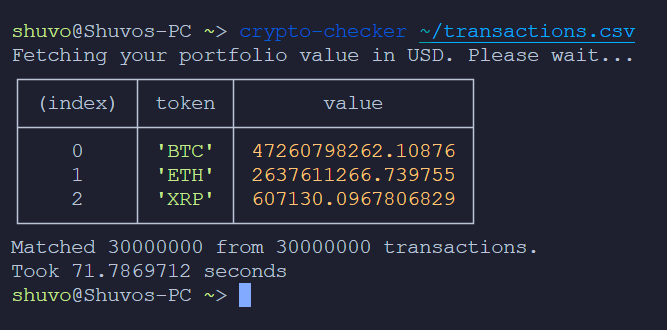
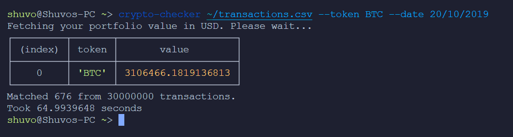

# Crypto Portfolio Checker

## Intro
Let us assume you are a crypto investor. You have made transactions over a period of time which is logged in a [CSV file](https://s3-ap-southeast-1.amazonaws.com/static.propine.com/transactions.csv.zip). This command line program does the following

 - Given no parameters, return the latest portfolio value per token in USD
 - Given a token, return the latest portfolio value for that token in USD
 - Given a date, return the portfolio value per token in USD on that date
 - Given a date and a token, return the portfolio value of that token in USD on that date

The CSV file has the following columns
 - timestamp: Integer number of seconds since the Epoch
 - transaction_type: Either a DEPOSIT or a WITHDRAWAL
 - token: The token symbol
 - amount: The amount transacted

Portfolio means the balance of the token where you need to add deposits and subtract withdrawals. The exchange rates are obtained from [cryptocompare](https://min-api.cryptocompare.com/). 

## Pre-requisites
This CLI tool is build with `TypeScript` and runs on `Node`. To run this we will need the following.
 - Node v14 or later
 - NPM

## How to run the program in Linux
 1. Clone the repository
 1. `cd <project_directory>`
 1. Run `cp .env.sample .env` command
 1. Put proper values in `.env` file
 1. Run `npm install` command
 1. Run `npm run build` command
 1. run `npm link` command
 1. Now you can run `crypto-checker` command

## CLI Tool 
The `crypto-checker` CLI tool will read from a CSV file where the transaction records are stored. The CSV file path is the required argument for the command.
```shell
$ crypto-checker <path_to_csv_file> 
```
The tool has 2 more options. 
1. `--token` or `-t` which takes a crypto token for value
2. `--date` or `-d` which take a date in `dd/mm/yyyy` or `yyyy-mm-dd` format

Below is the output for this command for the given CSV file with 30000000 rows.
```shell
$ crypto-checker ~/transactions.csv
```

```shell
$ crypto-checker ~/transactions.csv --token BTC --date 20/10/2019
```


